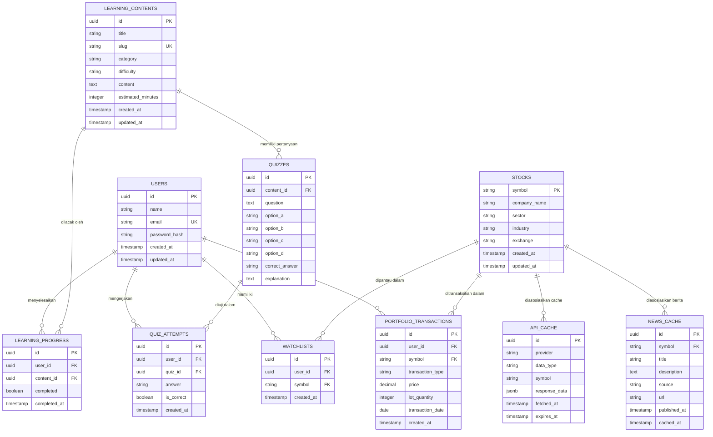

# Desain Database: AI-Powered Fundamental Investment Analyzer

## 1. Database Overview

Sistem menggunakan **PostgreSQL 17** sebagai basis data relasional utama, dikelola menggunakan **Prisma ORM** untuk type-safe queries, skema deklaratif, dan migrasi otomatis. Database ini menyimpan dua jenis data utama:
1. **Data Relasional Bisnis Inti**: Pengguna, saham, watchlist personal, transaksi portofolio berbasis lot, modul kurikulum edukasi, kuis, serta riwayat progres belajar pengguna.
2. **Data Cache API Eksternal (Semi-Terstruktur)**: Response mentah dari provider market data dan news feed yang disimpan dalam kolom `JSONB` dengan indeks `expires_at` untuk mempercepat respons sistem dan menekan konsumsi kuota API eksternal.

---

## 2. Entity Relationship Diagram (ERD)



---

## 3. Main Tables Specification

### 3.1 `users`
Menyimpan identitas akun pengguna sistem.
- `id`: UUID, Primary Key, default `gen_random_uuid()`.
- `name`: VARCHAR(100), Not Null.
- `email`: VARCHAR(150), Unique, Not Null, Indexed.
- `password_hash`: VARCHAR(255), Not Null (bcrypt hash).
- `created_at`: TIMESTAMP WITH TIME ZONE, default `now()`.
- `updated_at`: TIMESTAMP WITH TIME ZONE, default `now()`.

### 3.2 `stocks`
Katalog emiten saham Bursa Efek Indonesia (IDX).
- `symbol`: VARCHAR(10), Primary Key (contoh: "BBCA", "BBRI", "TLKM").
- `company_name`: VARCHAR(255), Not Null.
- `sector`: VARCHAR(100), Not Null, Indexed.
- `industry`: VARCHAR(100), Not Null.
- `exchange`: VARCHAR(20), default "IDX".
- `created_at`: TIMESTAMP WITH TIME ZONE, default `now()`.
- `updated_at`: TIMESTAMP WITH TIME ZONE, default `now()`.

### 3.3 `watchlists`
Daftar saham yang dipantau oleh pengguna secara spesifik.
- `id`: UUID, Primary Key.
- `user_id`: UUID, Foreign Key merujuk ke `users(id)` ON DELETE CASCADE.
- `symbol`: VARCHAR(10), Foreign Key merujuk ke `stocks(symbol)` ON DELETE CASCADE.
- `created_at`: TIMESTAMP WITH TIME ZONE, default `now()`.
- **Constraint**: `UNIQUE(user_id, symbol)`.

### 3.4 `portfolio_transactions`
Riwayat pencatatan transaksi beli dan jual saham pengguna berbasis lot.
- `id`: UUID, Primary Key.
- `user_id`: UUID, Foreign Key merujuk ke `users(id)` ON DELETE CASCADE, Indexed.
- `symbol`: VARCHAR(10), Foreign Key merujuk ke `stocks(symbol)` ON DELETE RESTRICT, Indexed.
- `transaction_type`: VARCHAR(10), Check constraint in ('BUY', 'SELL').
- `price`: NUMERIC(15, 2), Not Null (harga per lembar saham).
- `lot_quantity`: INTEGER, Not Null, Check `lot_quantity > 0` (1 lot = 100 lembar).
- `transaction_date`: DATE, Not Null.
- `created_at`: TIMESTAMP WITH TIME ZONE, default `now()`.

### 3.5 `api_cache`
Tabel caching data eksternal (quote harga, historical OHLCV, rasio fundamental).
- `id`: UUID, Primary Key.
- `provider`: VARCHAR(50), Not Null (contoh: "sectors_app", "twelve_data").
- `data_type`: VARCHAR(50), Not Null (contoh: "quote", "historical", "fundamentals").
- `symbol`: VARCHAR(10), Nullable (bisa berupa ticker atau "IHSG").
- `response_data`: JSONB, Not Null.
- `fetched_at`: TIMESTAMP WITH TIME ZONE, default `now()`.
- `expires_at`: TIMESTAMP WITH TIME ZONE, Not Null, Indexed.
- **Index**: Composite index `(provider, data_type, symbol)`.

### 3.6 `news_cache`
Tabel caching ringkasan berita pasar modal dan emiten terkini.
- `id`: UUID, Primary Key.
- `symbol`: VARCHAR(10), Nullable, Foreign Key merujuk ke `stocks(symbol)` ON DELETE SET NULL.
- `title`: VARCHAR(300), Not Null.
- `description`: TEXT, Nullable.
- `source`: VARCHAR(100), Not Null.
- `url`: TEXT, Not Null.
- `published_at`: TIMESTAMP WITH TIME ZONE, Not Null.
- `cached_at`: TIMESTAMP WITH TIME ZONE, default `now()`.

### 3.7 `learning_contents`
Materi kurikulum pembelajaran investasi berjenjang.
- `id`: UUID, Primary Key.
- `title`: VARCHAR(200), Not Null.
- `slug`: VARCHAR(200), Unique, Not Null, Indexed.
- `category`: VARCHAR(50), Check constraint in ('BEGINNER', 'FUNDAMENTAL', 'ANALYSIS', 'PORTFOLIO', 'STRATEGY').
- `difficulty`: VARCHAR(20), Check constraint in ('BEGINNER', 'INTERMEDIATE', 'ADVANCED').
- `content`: TEXT, Not Null (format Markdown).
- `estimated_minutes`: INTEGER, default 5.
- `created_at`: TIMESTAMP WITH TIME ZONE, default `now()`.
- `updated_at`: TIMESTAMP WITH TIME ZONE, default `now()`.

### 3.8 `learning_progress`
Pelacakan status penyelesaian materi belajar oleh pengguna.
- `id`: UUID, Primary Key.
- `user_id`: UUID, Foreign Key merujuk ke `users(id)` ON DELETE CASCADE.
- `content_id`: UUID, Foreign Key merujuk ke `learning_contents(id)` ON DELETE CASCADE.
- `completed`: BOOLEAN, default false.
- `completed_at`: TIMESTAMP WITH TIME ZONE, Nullable.
- **Constraint**: `UNIQUE(user_id, content_id)`.

### 3.9 `quizzes`
Pertanyaan evaluasi pemahaman terkait materi pembelajaran tertentu.
- `id`: UUID, Primary Key.
- `content_id`: UUID, Foreign Key merujuk ke `learning_contents(id)` ON DELETE CASCADE.
- `question`: TEXT, Not Null.
- `option_a`: VARCHAR(255), Not Null.
- `option_b`: VARCHAR(255), Not Null.
- `option_c`: VARCHAR(255), Not Null.
- `option_d`: VARCHAR(255), Not Null.
- `correct_answer`: VARCHAR(5), Check constraint in ('A', 'B', 'C', 'D').
- `explanation`: TEXT, Not Null.

### 3.10 `quiz_attempts`
Riwayat jawaban kuis pengguna untuk mengukur tingkat pemahaman.
- `id`: UUID, Primary Key.
- `user_id`: UUID, Foreign Key merujuk ke `users(id)` ON DELETE CASCADE.
- `quiz_id`: UUID, Foreign Key merujuk ke `quizzes(id)` ON DELETE CASCADE.
- `answer`: VARCHAR(5), Not Null.
- `is_correct`: BOOLEAN, Not Null.
- `created_at`: TIMESTAMP WITH TIME ZONE, default `now()`.

---

## 4. Relationships & Constraints

1. **User Isolation**:
   - Satu pengguna (`users`) memiliki banyak entri `watchlists` dan `portfolio_transactions`.
   - Menghapus user (`ON DELETE CASCADE`) akan membersihkan seluruh catatan watchlist, transaksi, progress belajar, dan riwayat kuis pengguna tersebut.
2. **Stock Referencing**:
   - `stocks` menjadi titik referensi bagi `watchlists` dan `portfolio_transactions`.
   - Penghapusan data emiten (`stocks`) diproteksi dengan `ON DELETE RESTRICT` jika ada transaksi portofolio aktif yang mereferensikannya.
3. **Unique Constraints**:
   - `UNIQUE(users.email)`: Memastikan alamat email tidak dapat diduplikasi.
   - `UNIQUE(watchlists.user_id, watchlists.symbol)`: Menghindari duplikasi saham yang sama dalam watchlist pengguna.
   - `UNIQUE(learning_progress.user_id, learning_progress.content_id)`: Memastikan satu entri progres per user per materi.

---

## 5. Naming Conventions

- **Tabel**: Huruf kecil, bentuk jamak dengan snake_case (contoh: `users`, `stocks`, `portfolio_transactions`, `learning_contents`).
- **Kolom**: Huruf kecil, snake_case (contoh: `user_id`, `password_hash`, `lot_quantity`, `created_at`).
- **Primary Key**: Bernama `id` (tipe UUID) kecuali tabel `stocks` yang menggunakan ticker saham sebagai natural key (`symbol`).
- **Foreign Key**: `<nama_tabel_tunggal>_id` (contoh: `user_id`, `content_id`, `quiz_id`).
- **Indeks**: Format `idx_<nama_tabel>_<nama_kolom>` (contoh: `idx_api_cache_expires_at`).

---

## 6. Migration Strategy (Prisma ORM)

1. **Schema Source of Truth**:
   Seluruh definisi struktur database didefinisikan dalam file `backend/prisma/schema.prisma`.
2. **Migration Command**:
   - Di development:
     ```sh
     npx prisma migrate dev --name init_database_schema
     ```
   - Di production / deployment:
     ```sh
     npx prisma migrate deploy
     ```
3. **Database Seeding**:
   Seeder diinisialisasi melalui file `backend/prisma/seed.ts` untuk mengisi:
   - Data emiten awal IDX (BBCA, BBRI, BMRI, TLKM, ASII, UNVR, ICBP, ADRO, dsb.).
   - Konten kurikulum edukasi lengkap Level 1 sampai Level 6.
   - Bank soal kuis untuk tiap topik edukasi.
   Perintah eksekusi seeder:
   ```sh
   npx prisma db seed
   ```
