# Desain Database: AI-Powered Fundamental Investment Analyzer

## 1. Database Overview

Sistem menggunakan **PostgreSQL 17** sebagai basis data relasional utama, dikelola menggunakan **Prisma ORM** untuk type-safe queries, skema deklaratif, dan migrasi otomatis. Database ini dirancang secara terstruktur (*normalized*) untuk mendukung dua sub-sistem utama:
1. **Sub-sistem 1 (Fayiz - Analisis Fundamental & AI)**:
   - Data katalog 80 emiten konstituen **Indeks IDX80**.
   - Data rasio fundamental keuangan 4 pilar (*Valuation, Profitability, Solvency, Dividends*) untuk fitur Stock Screener dan Comparison.
   - Data pergerakan harga harian dan ringkasan teknikal.
   - Data feed berita pasar modal teragregasi dengan klasifikasi sentimen otomatis (`[Positif]`, `[Netral]`, `[Negatif]`).
   - Data bursa global dan komoditas strategis acuan.
   - Daftar pantauan saham (*Watchlists*).
   - Log interaksi dan evaluasi AI (*Factual Consistency, Hallucination Flag, Latency*) untuk keperluan analisis ilmiah Bab 4 & 5 Skripsi.
   - Cache store JSONB dengan TTL untuk respons data pasar mentah eksternal.
2. **Sub-sistem 2 (Firman - Portofolio & Edukasi)**:
   - Pencatatan transaksi beli/jual portofolio berbasis lot riil (1 lot = 100 lembar).
   - Modul kurikulum edukasi investasi berjenjang 6 level dan pelacakan progres belajar.
   - Bank soal kuis evaluasi pemahaman investasi beserta riwayat pengerjaan user.

---

## 2. Entity Relationship Diagram (ERD)

```mermaid
erDiagram
    USERS ||--o{ WATCHLISTS : "memiliki"
    USERS ||--o{ AI_ANALYSIS_LOGS : "menghasilkan"
    USERS ||--o{ PORTFOLIO_TRANSACTIONS : "mencatat"
    USERS ||--o{ LEARNING_PROGRESS : "menyelesaikan"
    USERS ||--o{ QUIZ_ATTEMPTS : "mengerjakan"

    STOCKS ||--o{ STOCK_FUNDAMENTALS : "memiliki metrik"
    STOCKS ||--o{ STOCK_DAILY_PRICES : "memiliki riwayat harga"
    STOCKS ||--o{ NEWS_SENTIMENT : "memiliki berita"
    STOCKS ||--o{ WATCHLISTS : "dipantau dalam"
    STOCKS ||--o{ AI_ANALYSIS_LOGS : "dianalisis dalam"
    STOCKS ||--o{ PORTFOLIO_TRANSACTIONS : "ditransaksikan dalam"

    LEARNING_CONTENTS ||--o{ LEARNING_PROGRESS : "dilacak oleh"
    LEARNING_CONTENTS ||--o{ QUIZZES : "memiliki pertanyaan"

    QUIZZES ||--o{ QUIZ_ATTEMPTS : "diuji dalam"

    USERS {
        uuid id PK
        string name
        string email UK
        string password_hash
        string investor_profile "BEGINNER | EXPERIENCED"
        timestamp created_at
        timestamp updated_at
    }

    STOCKS {
        string symbol PK "Contoh: BBCA"
        string company_name
        string sector
        string industry
        string exchange "IDX"
        boolean is_idx80
        timestamp created_at
        timestamp updated_at
    }

    STOCK_FUNDAMENTALS {
        uuid id PK
        string symbol FK
        decimal market_cap
        decimal pe_ratio "Price to Earnings (PER)"
        decimal pbv_ratio "Price to Book Value (PBV)"
        decimal roe "Return on Equity (ROE)"
        decimal roa "Return on Assets (ROA)"
        decimal der "Debt to Equity Ratio (DER)"
        decimal net_profit_margin "Net Profit Margin (NPM)"
        decimal eps "Earnings Per Share"
        decimal dividend_yield "Dividend Yield"
        timestamp updated_at
    }

    STOCK_DAILY_PRICES {
        uuid id PK
        string symbol FK
        decimal close_price
        decimal change_amount
        decimal change_percent
        decimal open_price
        decimal high_price
        decimal low_price
        bigint volume
        timestamp last_updated
    }

    NEWS_SENTIMENT {
        uuid id PK
        string symbol FK
        string title
        text description
        string source
        string url
        string sentiment "POSITIVE | NEUTRAL | NEGATIVE"
        decimal sentiment_score "-1.00 s.d +1.00"
        timestamp published_at
        timestamp cached_at
    }

    MACRO_MARKETS {
        uuid id PK
        string asset_category "GLOBAL_INDEX | COMMODITY"
        string asset_name "S&P 500, Gold, Oil, dll."
        string symbol_code
        decimal price
        decimal change_percent
        timestamp updated_at
    }

    WATCHLISTS {
        uuid id PK
        uuid user_id FK
        string symbol FK
        timestamp created_at
    }

    AI_ANALYSIS_LOGS {
        uuid id PK
        uuid user_id FK
        string symbol FK
        string investor_profile "BEGINNER | EXPERIENCED"
        text user_question
        jsonb grounded_context
        text ai_response
        decimal factual_consistency_score "Evaluasi Skripsi"
        boolean hallucination_flag "Evaluasi Skripsi"
        integer latency_ms "Evaluasi Caching & AI"
        timestamp created_at
    }

    API_CACHE {
        uuid id PK
        string provider
        string endpoint_key
        jsonb response_data
        timestamp fetched_at
        timestamp expires_at
    }

    PORTFOLIO_TRANSACTIONS {
        uuid id PK
        uuid user_id FK
        string symbol FK
        string transaction_type "BUY | SELL"
        decimal price
        integer lot_quantity "1 lot = 100 lembar"
        date transaction_date
        timestamp created_at
    }

    LEARNING_CONTENTS {
        uuid id PK
        string title
        string slug UK
        string category
        string difficulty
        text content
        integer estimated_minutes
        timestamp created_at
        timestamp updated_at
    }

    LEARNING_PROGRESS {
        uuid id PK
        uuid user_id FK
        uuid content_id FK
        boolean completed
        timestamp completed_at
    }

    QUIZZES {
        uuid id PK
        uuid content_id FK
        text question
        string option_a
        string option_b
        string option_c
        string option_d
        string correct_answer
        text explanation
    }

    QUIZ_ATTEMPTS {
        uuid id PK
        uuid user_id FK
        uuid quiz_id FK
        string answer
        boolean is_correct
        timestamp created_at
    }
```



---

## 3. Spesifikasi Rinci Tabel

### 3.1 `users`
Menyimpan identitas akun pengguna sistem dan preferensi profil investor.
- `id`: UUID, Primary Key, default `gen_random_uuid()`.
- `name`: VARCHAR(100), Not Null.
- `email`: VARCHAR(150), Unique, Not Null, Indexed.
- `password_hash`: VARCHAR(255), Not Null (bcrypt hash).
- `investor_profile`: VARCHAR(20), Not Null, default `'BEGINNER'`, Check constraint in (`'BEGINNER'`, `'EXPERIENCED'`). Menentukan gaya komunikasi analisis AI Copilot.
- `created_at`: TIMESTAMP WITH TIME ZONE, default `now()`.
- `updated_at`: TIMESTAMP WITH TIME ZONE, default `now()`.

### 3.2 `stocks`
Katalog master emiten saham Bursa Efek Indonesia (fokus utama konstituen Indeks IDX80).
- `symbol`: VARCHAR(10), Primary Key (contoh: "BBCA", "BBRI", "TLKM").
- `company_name`: VARCHAR(255), Not Null.
- `sector`: VARCHAR(100), Not Null, Indexed.
- `industry`: VARCHAR(100), Not Null.
- `exchange`: VARCHAR(20), default "IDX".
- `is_idx80`: BOOLEAN, default true, Indexed.
- `created_at`: TIMESTAMP WITH TIME ZONE, default `now()`.
- `updated_at`: TIMESTAMP WITH TIME ZONE, default `now()`.

### 3.3 `stock_fundamentals`
Menyimpan rasio keuangan 4 pilar emiten secara relasional untuk pencarian cepat di **Stock Screener** dan **Stock Comparison**.
- `id`: UUID, Primary Key.
- `symbol`: VARCHAR(10), Unique, Foreign Key merujuk ke `stocks(symbol)` ON DELETE CASCADE.
- `market_cap`: NUMERIC(20, 2), Nullable.
- `pe_ratio`: NUMERIC(10, 2), Nullable, Indexed (Price to Earnings Ratio).
- `pbv_ratio`: NUMERIC(10, 2), Nullable, Indexed (Price to Book Value).
- `roe`: NUMERIC(8, 4), Nullable, Indexed (Return on Equity, desimal: 0.1850 = 18.5%).
- `roa`: NUMERIC(8, 4), Nullable (Return on Assets).
- `der`: NUMERIC(8, 4), Nullable, Indexed (Debt to Equity Ratio).
- `net_profit_margin`: NUMERIC(8, 4), Nullable (Net Profit Margin).
- `eps`: NUMERIC(15, 2), Nullable (Earnings Per Share).
- `dividend_yield`: NUMERIC(8, 4), Nullable (Dividend Yield).
- `updated_at`: TIMESTAMP WITH TIME ZONE, default `now()`.

### 3.4 `stock_daily_prices`
Menyimpan ringkasan harga pasar terkini dan pergerakan harian untuk Dashboard dan Detail Saham.
- `id`: UUID, Primary Key.
- `symbol`: VARCHAR(10), Unique, Foreign Key merujuk ke `stocks(symbol)` ON DELETE CASCADE.
- `close_price`: NUMERIC(15, 2), Not Null.
- `change_amount`: NUMERIC(15, 2), Not Null.
- `change_percent`: NUMERIC(8, 4), Not Null.
- `open_price`: NUMERIC(15, 2), Nullable.
- `high_price`: NUMERIC(15, 2), Nullable.
- `low_price`: NUMERIC(15, 2), Nullable.
- `volume`: BIGINT, Nullable.
- `last_updated`: TIMESTAMP WITH TIME ZONE, default `now()`.

### 3.5 `news_sentiment`
Menyimpan berita pasar modal dan emiten dengan pelabelan sentimen otomatis.
- `id`: UUID, Primary Key.
- `symbol`: VARCHAR(10), Nullable, Foreign Key merujuk ke `stocks(symbol)` ON DELETE SET NULL, Indexed.
- `title`: VARCHAR(300), Not Null.
- `description`: TEXT, Nullable.
- `source`: VARCHAR(100), Not Null.
- `url`: TEXT, Not Null.
- `sentiment`: VARCHAR(20), Not Null, Check constraint in (`'POSITIVE'`, `'NEUTRAL'`, `'NEGATIVE'`).
- `sentiment_score`: NUMERIC(4, 2), Nullable (rentang -1.00 s.d +1.00).
- `published_at`: TIMESTAMP WITH TIME ZONE, Not Null, Indexed.
- `cached_at`: TIMESTAMP WITH TIME ZONE, default `now()`.

### 3.6 `macro_markets`
Menyimpan pergerakan indeks bursa global dan komoditas acuan pasar modal.
- `id`: UUID, Primary Key.
- `asset_category`: VARCHAR(30), Not Null, Check constraint in (`'GLOBAL_INDEX'`, `'COMMODITY'`).
- `asset_name`: VARCHAR(100), Not Null (contoh: "S&P 500", "Gold", "Crude Oil Brent").
- `symbol_code`: VARCHAR(20), Unique, Not Null (contoh: "^GSPC", "GC=F").
- `price`: NUMERIC(15, 2), Not Null.
- `change_percent`: NUMERIC(8, 4), Not Null.
- `updated_at`: TIMESTAMP WITH TIME ZONE, default `now()`.

### 3.7 `watchlists`
Daftar saham yang dipantau secara personal oleh investor.
- `id`: UUID, Primary Key.
- `user_id`: UUID, Foreign Key merujuk ke `users(id)` ON DELETE CASCADE, Indexed.
- `symbol`: VARCHAR(10), Foreign Key merujuk ke `stocks(symbol)` ON DELETE CASCADE.
- `created_at`: TIMESTAMP WITH TIME ZONE, default `now()`.
- **Constraint**: `UNIQUE(user_id, symbol)`.

### 3.8 `ai_analysis_logs` (Pondasi Evaluasi Ilmiah Bab 4 Skripsi)
Mencatat seluruh interaksi dan hasil analisis AI berbasis Context Grounding untuk pembuktian metrik skripsi.
- `id`: UUID, Primary Key.
- `user_id`: UUID, Nullable, Foreign Key merujuk ke `users(id)` ON DELETE SET NULL.
- `symbol`: VARCHAR(10), Nullable, Foreign Key merujuk ke `stocks(symbol)` ON DELETE SET NULL.
- `investor_profile`: VARCHAR(20), Not Null (`'BEGINNER'` / `'EXPERIENCED'`).
- `user_question`: TEXT, Not Null.
- `grounded_context`: JSONB, Not Null (snapshot data terstruktur yang dikirim ke LLM).
- `ai_response`: TEXT, Not Null.
- `factual_consistency_score`: NUMERIC(5, 2), Nullable (target pengujian $\ge 95\%$).
- `hallucination_flag`: BOOLEAN, default false.
- `latency_ms`: INTEGER, Not Null (waktu respons pemrosesan dalam milidetik).
- `created_at`: TIMESTAMP WITH TIME ZONE, default `now()`.

### 3.9 `api_cache`
Cache respons mentah data pihak ketiga (misalnya data time-series candlestick Yahoo Finance) berformat JSONB dengan TTL.
- `id`: UUID, Primary Key.
- `provider`: VARCHAR(50), Not Null (contoh: "yahoo_finance").
- `endpoint_key`: VARCHAR(150), Unique, Not Null, Indexed.
- `response_data`: JSONB, Not Null.
- `fetched_at`: TIMESTAMP WITH TIME ZONE, default `now()`.
- `expires_at`: TIMESTAMP WITH TIME ZONE, Not Null, Indexed.

### 3.10 `portfolio_transactions` (Scope Firman)
Riwayat pencatatan transaksi beli dan jual saham pengguna berbasis lot riil (1 lot = 100 lembar).
- `id`: UUID, Primary Key.
- `user_id`: UUID, Foreign Key merujuk ke `users(id)` ON DELETE CASCADE, Indexed.
- `symbol`: VARCHAR(10), Foreign Key merujuk ke `stocks(symbol)` ON DELETE RESTRICT, Indexed.
- `transaction_type`: VARCHAR(10), Check constraint in (`'BUY'`, `'SELL'`).
- `price`: NUMERIC(15, 2), Not Null.
- `lot_quantity`: INTEGER, Not Null, Check `lot_quantity > 0`.
- `transaction_date`: DATE, Not Null.
- `created_at`: TIMESTAMP WITH TIME ZONE, default `now()`.

### 3.11 `learning_contents` (Scope Firman)
Materi kurikulum pembelajaran investasi berjenjang.
- `id`: UUID, Primary Key.
- `title`: VARCHAR(200), Not Null.
- `slug`: VARCHAR(200), Unique, Not Null, Indexed.
- `category`: VARCHAR(50), Check constraint in (`'BEGINNER'`, `'FUNDAMENTAL'`, `'ANALYSIS'`, `'PORTFOLIO'`, `'STRATEGY'`).
- `difficulty`: VARCHAR(20), Check constraint in (`'BEGINNER'`, `'INTERMEDIATE'`, `'ADVANCED'`).
- `content`: TEXT, Not Null (Markdown).
- `estimated_minutes`: INTEGER, default 5.
- `created_at`: TIMESTAMP WITH TIME ZONE, default `now()`.
- `updated_at`: TIMESTAMP WITH TIME ZONE, default `now()`.

### 3.12 `learning_progress` (Scope Firman)
Pelacakan status penyelesaian materi belajar oleh pengguna.
- `id`: UUID, Primary Key.
- `user_id`: UUID, Foreign Key merujuk ke `users(id)` ON DELETE CASCADE.
- `content_id`: UUID, Foreign Key merujuk ke `learning_contents(id)` ON DELETE CASCADE.
- `completed`: BOOLEAN, default false.
- `completed_at`: TIMESTAMP WITH TIME ZONE, Nullable.
- **Constraint**: `UNIQUE(user_id, content_id)`.

### 3.13 `quizzes` (Scope Firman)
Pertanyaan evaluasi pemahaman terkait materi pembelajaran tertentu.
- `id`: UUID, Primary Key.
- `content_id`: UUID, Foreign Key merujuk ke `learning_contents(id)` ON DELETE CASCADE.
- `question`: TEXT, Not Null.
- `option_a`: VARCHAR(255), Not Null.
- `option_b`: VARCHAR(255), Not Null.
- `option_c`: VARCHAR(255), Not Null.
- `option_d`: VARCHAR(255), Not Null.
- `correct_answer`: VARCHAR(5), Check constraint in (`'A'`, `'B'`, `'C'`, `'D'`).
- `explanation`: TEXT, Not Null.

### 3.14 `quiz_attempts` (Scope Firman)
Riwayat jawaban kuis pengguna untuk mengukur tingkat pemahaman.
- `id`: UUID, Primary Key.
- `user_id`: UUID, Foreign Key merujuk ke `users(id)` ON DELETE CASCADE.
- `quiz_id`: UUID, Foreign Key merujuk ke `quizzes(id)` ON DELETE CASCADE.
- `answer`: VARCHAR(5), Not Null.
- `is_correct`: BOOLEAN, Not Null.
- `created_at`: TIMESTAMP WITH TIME ZONE, default `now()`.

---

## 4. Relationships & Constraints

1. **User Isolation**:
   - Satu pengguna (`users`) memiliki banyak entri `watchlists`, `ai_analysis_logs`, dan `portfolio_transactions`.
   - Menghapus user (`ON DELETE CASCADE`) akan membersihkan seluruh catatan watchlist, transaksi, progress belajar, dan log yang terkait.
2. **Stock Referencing**:
   - `stocks` menjadi titik referensi bagi `stock_fundamentals`, `stock_daily_prices`, `news_sentiment`, `watchlists`, dan `portfolio_transactions`.
   - Penghapusan data emiten diproteksi dengan `ON DELETE RESTRICT` jika ada transaksi portofolio aktif yang mereferensikannya.
3. **Indexing Strategy**:
   - B-Tree Index pada `stock_fundamentals(pe_ratio, pbv_ratio, roe, der)` untuk query screener berkecepatan tinggi.
   - Composite Index pada `api_cache(provider, endpoint_key)` dan Index pada `api_cache(expires_at)` untuk pembersihan cache otomatis.
   - Index pada `news_sentiment(published_at)` dan `news_sentiment(symbol)` untuk penyortiran feed berita terkini.

---

## 5. Migration Strategy (Prisma ORM)

1. **Schema Source of Truth**:
   Seluruh definisi struktur database didefinisikan dalam file `backend/prisma/schema.prisma`.
2. **Migration Command**:
   - Di development:
     ```sh
     npx prisma migrate dev --name init_database_schema
     ```
   - Di production / deployment:
     ```sh
     npx prisma migrate deploy
     ```
3. **Database Seeding**:
   Seeder diinisialisasi melalui file `backend/prisma/seed.ts` untuk mengisi:
   - 80 emiten konstituen **Indeks IDX80** lengkap dengan sektor dan sub-sektor.
   - Data awal fundamental dan pergerakan harga.
   - Data materi edukasi Level 1 s.d. Level 6 dan bank soal kuis (scope Firman).
   Perintah eksekusi seeder:
   ```sh
   npx prisma db seed
   ```
